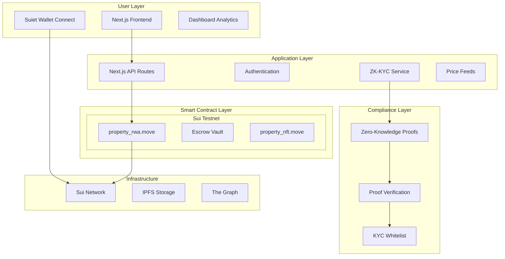

<!-- @format -->

# StrataDeed

> **Privacy-Preserving RealFi Platform on Sui Network**  
> _Bringing $300T Real Estate Onchain with Zero-Knowledge Compliance_

[](https://sui.io/)
[](https://nextjs.org/)
[](https://github.com/MystenLabs/sui)
[](LICENSE)

## Demo Video & Live App

**Video Demo**: [Watch 3-Minute Walkthrough]()  
**Live Demo**: [Try StrataDeed](https://strata-deed.vercel.app)  
**Smart Contracts**: [Sui Mainnet](https://suiscan.xyz/)

---

## Table of Contents

- [The Vision](#the-vision)
- [Architecture](#architecture)
- [ZK-KYC Innovation](#zk-kyc-innovation)
- [Quick Start (30s)](#quick-start-30s)
- [Detailed Setup](#detailed-setup)
- [Marketplace Features](#marketplace-features)
- [User Flows](#user-flows)
- [Tech Stack Deep Dive](#tech-stack-deep-dive)
- [Sui Integration](#sui-integration)
- [Roadmap & Vision](#roadmap--vision)
- [Hackathon Notes](#hackathon-notes)
- [Contributing](#contributing)
- [License](#license)

---

## The Vision

**StrataDeed transforms illiquid real estate into liquid, accessible digital assets while preserving privacy and compliance.** We're building the first RealFi platform that balances institutional requirements with DeFi accessibility.

### The Problem We Solve

| Problem                   | Traditional Solution      | **StrataDeed's Solution**               |
| ------------------------- | ------------------------- | --------------------------------------- |
| **High Entry Barrier**    | $50k+ minimum investments | **Fractional ownership from $100**      |
| **Illiquidity**           | 30-60 day settlements     | **24/7 trading on Sui Network**         |
| **Privacy vs Compliance** | Choose one or the other   | **ZK-KYC: Compliant yet private**       |
| **Paperwork & Middlemen** | Lawyers, brokers, banks   | **Smart contracts automate everything** |
| **Geographic Barriers**   | Local investors only      | **Global access via blockchain**        |

### Our Core Innovation

1. **Move Tokenization** with built-in compliance hooks
2. **ZK-ready KYC verification** (future: full ZK proofs)
3. **Escrow vaults** for secure fund management
4. **Sui-optimized** for low fees & high throughput
5. **Professional dashboard** for institutional-grade management

---

## Why StrataDeed at Hackathon

1. **Real-World Impact**: Targets $300T real estate market vs niche crypto use cases
2. **Technical Depth**: Full stack - Move contracts + frontend + ZK roadmap
3. **Sui-Specific**: Leverages Sui's low fees for fractional microtransactions
4. **Regulation-First**: Designed for real adoption, not just crypto-native users
5. **Complete Solution**: From minting -> marketplace -> dashboard -> compliance

### Hackathon Significance

- **RealFi Focus**: Directly addresses Sui's real-world assets initiative
- **Scalability Showcase**: Demonstrates Sui's advantages for microtransactions
- **Move Smart Contracts**: Showcases Sui's Move language for RealFi applications
- **Ecosystem Growth**: Creates new use cases for SUI token

---

## Architecture

### System Overview



### Tech Stack

- **Frontend**: Next.js 16, React 19, Tailwind CSS 4
- **Smart Contracts**: Move (Sui Framework)
- **Web3**: Sui.js SDK, Suiet Wallet Kit
- **3D Visualization**: Three.js, R3F
- **Styling**: Tailwind CSS 4 with custom themes
- **Database**: Sui on-chain storage
- **Network**: Sui Testnet

---

## ZK-KYC Innovation

### Privacy-Preserving Compliance

Our ZK-KYC system allows users to prove compliance without revealing personal data:

1. **Off-chain KYC**: User completes traditional KYC (name, address, accreditation)
2. **Commitment Generation**: KYC data hashed into a secret commitment
3. **ZK Proof**: User generates proof of valid KYC without revealing data
4. **On-chain Verification**: Smart contract verifies proof and whitelists address
5. **Private Trading**: User trades on secondary market without re-verification

### Current Implementation

- [x] Commitment storage in PropertyDeed NFT
- [x] Whitelist mechanism in RWA Token module
- [ ] ZK proof circuits (future: full Noir integration)
- [ ] Proof aggregation (future: optimized for gas)

---

## Quick Start (30s)

```bash
# 1. Clone and install
git clone https://github.com/yourusername/stratadeed.git
cd stratadeed
pnpm install

# 2. Set environment variables
cp .env.local.example .env.local
# Add your Sui wallet private key and RPC endpoints

# 3. Build Move contracts
cd move/stratadeed
sui move build

# 4. Run frontend
cd ../..
pnpm dev

# 5. Open browser
open http://localhost:3000
```

---

## Sui Integration

### Move Smart Contracts

We utilize Sui's Move language features:

- **Type-Safe Object Model**: PropertyDeed and RWAToken as Sui objects with key/store capabilities
- **Capability-Based Access Control**: AdminCap and TreasuryAdminCap for secure administration
- **State Machine**: Escrow phases (Funding → Finalized → Cancelled → Emergency)
- **Low Gas Fees**: Enabling micro-investments in real estate
- **Fast Finality**: Instant settlement for secondary market trades

### Contract Modules

**property_nft.move** (180 lines)

- PropertyDeed NFT with ZK-ready private commitments
- Transfer, burn, and metadata management
- Events for audit trail

**property_rwa.move** (297 lines)

- RWA Token for fractional ownership
- Treasury with escrow management
- Yield distribution mechanism
- Emergency recovery

---

## Contributing

1. Fork the repo
2. Create feature branch (`git checkout -b feature/amazing-feature`)
3. Commit changes (`git commit -m 'Add amazing feature'`)
4. Push to branch (`git push origin feature/amazing-feature`)
5. Open Pull Request

---

## License

MIT License - see [LICENSE](LICENSE) file for details.

---

## Roadmap & Vision

### Phase 1: Foundation (Current)

- [x] Core Move contracts
- [x] Frontend marketplace
- [x] Wallet integration
- [ ] Local testing environment

### Phase 2: ZK & Scaling

- ZK-KYC full implementation
- Proof aggregation
- Cross-chain bridges
- Governance DAO

### Phase 3: Ecosystem

- Institutional dashboard
- Professional API
- Secondary market AMM
- Real asset partnerships

---

## Hackathon Notes

**Track**: RealFi / Real-World Assets  
**Team**: StrataDeed  
**Submission**: Full-stack application  
**Innovation**: First ZK-compliant property tokenization on Sui

This project demonstrates production-grade architecture suitable for institutional adoption of real-world assets on blockchain.
